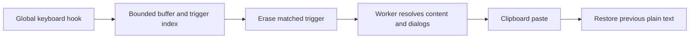

# Input capture and snippet expansion review

Documented: 2026-09-26

Reviewed revision: `139d8c3` (`feat/msix-store-package`)

Status: historical review; see the 2026-10-05 remediation update below.

## Scope and evidence

This review traced keyboard capture, trigger matching, worker dispatch, variable
resolution, and clipboard insertion. Findings were established by source
inspection and synthetic, mocked reproductions. No physical key injection,
live clipboard access, or user snippet data was used in the reproductions.

The checkout had advanced to `a92477c` (`feat/ui-language-selection`) when this
report was written. The results below describe the reviewed revision; the
reproductions and test suite were not rerun against the newer revision for this
documentation-only change. Links identify modules and function names rather
than assuming that historical line numbers remain current.

## Operating mechanism



- [`sniptype.pyw`](../sniptype.pyw): `run_keyboard_listener()` registers pynput
  callbacks. `on_press()` feeds characters into a bounded suffix buffer.
- [`trigger_index.py`](../trigger_index.py): precompiled last-character buckets
  select direct triggers longest-first; mapping triggers use compiled prefixes.
  Immediate expansion is the default. Terminator mode waits for a configured
  word-ending character; Enter resets the buffer rather than expanding.
- `Sniptype._dispatch_expansion()` erases the trigger and starts a worker.
  `_run_expansion()` routes to `expand_snippet()` or `run_slow_snippet()`.
- [`variable_support.py`](../variable_support.py) resolves clipboard and snippet
  references. Forms and other dialogs use the shared
  [`GuiThread`](../gui_thread.py), keeping GUI operations off the listener.
- [`runtime_support.py`](../runtime_support.py): `TextInserter` locks the
  clipboard snapshot/write/paste/restore sequence. Windows uses tagged batches
  in [`win_input.py`](../win_input.py) so its own erase/paste events do not
  re-enter detection.

Indexed matching, background resolution, shared GUI ownership, and tagged
injection are sound foundations. The main gaps concern input state and the
lifecycle between detection and insertion.

## Findings

### F1 — High: pausing still erases matching input

**Location:** `Sniptype.on_press()`, `_dispatch_expansion()`, and
`_run_expansion()` in [`sniptype.pyw`](../sniptype.pyw).

The disabled-state guard runs in the worker, after dispatch has already erased
the trigger. With synthetic `xhi -> hello` and `enabled = False`, passing
`x`, `h`, `i` through `on_press()` produced:

```text
erase(3)
worker queued: _run_expansion("xhi", "", False)
```

The worker then returns without insertion. Pausing therefore removes typed
text instead of leaving it untouched.

**Recommended correction:** reject expansion before any erase or worker
dispatch when disabled. Keep the workflow hotkey for re-enabling available.
Clear stale matching state at the enable/disable boundary.

**Acceptance:** callback-level tests prove that typing triggers while paused
causes no erasure, insertion, or expansion worker, and that re-enabling does not
complete a trigger partially captured while paused.

### F2 — High: navigation leaves stale trigger state

**Location:** `Sniptype.on_press()` and `_handle_char()` in
[`sniptype.pyw`](../sniptype.pyw).

The listener handles Enter and Backspace but does not invalidate the buffer for
cursor navigation. With `xhi -> hello`, the synthetic sequence
`x`, `Key.left`, `h`, `i` still produced `erase(3)` and dispatched `xhi`, although
the text before the cursor no longer represents that sequence.

There is also no foreground-window or mouse-navigation boundary for the buffer.
Cross-window corruption is an inference from this missing boundary; a physical
application-switch reproduction was not performed.

**Recommended correction:** invalidate captured text on navigation and relevant
editing/context changes. Track the text target so input captured in one target
cannot complete a trigger in another, without introducing blocking work in the
keyboard hook.

**Acceptance:** navigation, selection changes, and target switches cannot join
separate text fragments into a trigger or erase unrelated text.

### F3 — High: workers can insert into a different target or out of order

**Location:** `Sniptype._dispatch_expansion()`, `_run_expansion()`, and
`expand_snippet()` in [`sniptype.pyw`](../sniptype.pyw);
`BackgroundTaskRunner.start()` in [`runtime_support.py`](../runtime_support.py).

Every match starts an independent worker. Ordinary expansion does not retain
and validate the original text target before insertion. The clipboard lock
serializes individual paste operations, not detection, erasure, resolution,
and insertion as a complete operation.

Two controlled reproductions showed:

```text
Trigger detected in simulated editor A; worker runs after target becomes B:
  insertion target = B
  capture_text_target calls = 0
  restore_text_target calls = 0

Typed order:    xslow, xfast
Inserted order: SECOND, FIRST
```

The ordering reproduction used two worker threads and an event barrier to hold
the first provider until the second finished. These are software-level
reproductions, not physical desktop verification. Modal dialogs already have
focus-restoration logic; that does not protect the whole expansion lifecycle.

**Recommended correction:** define a bounded expansion lifecycle with explicit
ordering and cancellation. Associate each operation with its original target
and invalidate unsafe work when input context changes. Serializing workers
alone is insufficient if erasure still happens independently at detection.
Avoid restoring focus unexpectedly to force a stale result into an application.

**Acceptance:** slow/fast overlaps preserve the defined ordering policy;
typing, navigation, or target changes during resolution cannot send stale
results into another field; cancellation has a clear, non-destructive outcome.

### F4 — Medium: native Space never reaches the matcher

**Location:** `Sniptype.on_press()` in [`sniptype.pyw`](../sniptype.pyw).

The inspected Windows pynput backend maps virtual key `0x20` to `Key.space`.
That object has no `.char`, and the callback has no branch normalizing it to
`" "`. The real callback path therefore differs from matcher-only tests.

```text
terminator_mode = True
keys = x, h, i, Key.space
buffer after input = "xhi"
erase calls = 0
worker calls = 0
```

**Recommended correction:** normalize native Space before character matching.
Exercise `on_press()` with native special-key representations, rather than
testing space only through `_handle_char(" ")`.

**Acceptance:** Space expands a terminated trigger exactly once, erases the
correct number of characters, and is re-emitted only after successful insertion.
Space also remains represented correctly in immediate-mode buffer state.

### F5 — Medium: failed Windows injection is treated as success

**Location:** `TextInserter._send_paste_shortcut()` and `_paste_value()` in
[`runtime_support.py`](../runtime_support.py); `Sniptype._erase_chars()` in
[`sniptype.pyw`](../sniptype.pyw).

A `False` result from `batch_keyboard.paste()` only produces a log warning.
The caller continues through restoration and returns success. The deterministic
mock used a successful clipboard write and a failed batch paste:

```text
insert_text("EXPANDED") result = True
clipboard writes = ["EXPANDED", "ORIGINAL"]
typed fallback calls = 0
notification calls = 0
```

The erase path likewise logs a failed batch but returns normally, allowing
dispatch to clear the buffer and start expansion despite unsuccessful erasure.

**Recommended correction:** propagate explicit injection outcomes and stop
downstream actions after failure. Distinguish complete rejection from possible
partial injection before attempting any fallback; do not blindly repeat input.
Report an actionable failure without recording successful expansion.

**Acceptance:** rejected erase never dispatches expansion; rejected paste never
reports success; clipboard recovery and notification behavior are tested.
Multiline recovery must continue to avoid synthesizing Enter keystrokes.

### F6 — Medium: clipboard data is reinterpreted as form syntax

**Location:** `Sniptype.run_slow_snippet()` in
[`sniptype.pyw`](../sniptype.pyw).

The method resolves inline variables and then discovers form fields from the
modified text. Clipboard content can consequently introduce a new field:

```text
Template: Hi %%name%% %%clipboard-paste%%
Clipboard: %%extra%%
Actual fields: ["name", "extra"]
Supplied values: name=Ana, extra=REPLACED
Actual output: Hi Ana REPLACED
```

The clipboard token should remain literal content rather than create a field.
The isolated variable resolver already has a test for a clipboard-injected
token remaining literal; the later form-discovery pass defeats that behavior.

**Recommended correction:** preserve the distinction between template tokens
and substituted data. Derive form fields from the intended template structure
and ensure later rendering cannot reinterpret clipboard or user-entered values.

**Acceptance:** clipboard text containing `%%...%%` does not create fields or
undergo unintended substitution in either ordinary or structured forms.

## Existing limitation and separate hygiene note

Clipboard preservation saves only plain text. Images, file lists, and rich
formats are not preserved by the normal expansion round-trip. This is an
existing documented ceiling in `TextInserter._paste_value()`, not a newly
discovered defect.

The expected root `CLAUDE.md` pointer was absent during the review. No instruction
files were changed; this observation was not revalidated for the newer checkout.

## Verification and limits

At reviewed revision `139d8c3`:

- Focused unittest modules: `test_hotpath`, `test_trigger_index`,
  `test_variable_support`, `test_runtime_support`, `test_win_input`, and
  `test_clipboard_support`.
- Result: 319 tests run, 318 passed, one platform-specific test skipped,
  zero failures.
- `python -m ruff check source`: passed.
- Additional synthetic probes confirmed paused erasure, navigation state,
  native Space handling, worker ordering/target behavior, failed-paste success,
  and clipboard-created form fields.
- No source fixes, dependency changes, commits, or publication were performed.
- The full test suite, physical keyboard-to-editor behavior, installed executable,
  packaged builds, and native macOS behavior were not verified by this review.

Start remediation with the pause guard and callback-level regression coverage,
then address input-context invalidation and expansion ordering before extending
the runtime.

## Remediation update — 2026-10-05

This update describes local source changes based on `b8d6835`, rather than
reinterpreting the original `139d8c3` evidence. The base revision already
contained the pause, native Space, injection-failure and template/data fixes,
plus navigation/window resets and slow-result target guards. The remaining
reproduced defects were same-window mouse clicks and overlapping fast workers.

| Finding | Current source behavior |
| --- | --- |
| F1 — pause | The pause gate clears captured text before matching or erasing. Already present in the base revision. |
| F2 — buffer context | Navigation/window resets remain. The new mouse observer invalidates captured fragments after a button-down, including clicks within the same window. A click observed between matching and dispatch prevents erasure. |
| F3 — pending result target/order | Every dispatch has a trigger generation and captures the click generation and original foreground window before erasure. A click or newer trigger invalidates an unfinished automatic paste, including a fast result. Slow results also retain the ordinary-typing guard. |
| F4 — native Space | `Key.space` is normalized to a literal space before matching. Already present in the base revision. |
| F5 — rejected input | Failed erase does not dispatch; failed paste leaves clipboard recovery and reports failure. Already present in the base revision. |
| F6 — clipboard/form syntax | Clipboard, provider and form values remain data instead of creating template fields. Already present in the base revision. |

### Ordering and recovery policy

A newer matched trigger cancels an older unfinished automatic insertion. This
policy prevents reverse insertion without queuing workers or blocking the global
keyboard hook. The canceled result remains on the clipboard with a `paste-stale`
notice for manual Ctrl+V. Completed results still insert independently in typed
order; a fast result still survives ordinary subsequent typing. This policy
does not automatically insert every overlapping result.

Expansion dialogs rebaseline their own keyboard and mouse activity after focus
returns to the original target, while retaining the original trigger generation.
A dialog cannot revive an overtaken result. The terminator is checked again
after clipboard restoration so a click during restoration cannot receive it.

### Mouse observation

[`mouse_input.py`](../mouse_input.py) uses a private Windows message-only window
registered for background mouse Raw Input. Motion, button releases and wheel
packets leave the generation unchanged; the five button-down flags invalidate
the target. It preserves legacy mouse delivery and installs no synchronous
Windows mouse hook. This follows Microsoft's
[Raw Input guidance](https://learn.microsoft.com/en-us/windows/win32/inputdev/about-raw-input).
Off Windows it uses the existing pynput mouse backend.

Capture starts before keyboard listening, and both listeners stop on shutdown
or startup failure. Native registration is removed and the message window/class
are released. Failed capture startup disables expansion with a notification;
failed observation makes subsequent target checks refuse automatic insertion.

### Regression evidence and remaining verification

- New regressions reproduced seven failures against the unchanged base behavior
  before implementation: joined fragments after clicks, click-retargeted pending
  results, reversed/overtaken fast results, and post-dialog click retargeting.
- Focused final verification: 89 tests passed, zero skipped. Coverage includes
  real concurrent worker resolution over a mocked clipboard, both completion
  orders, form-dialog clicks, native mouse packets, failure/cleanup paths,
  numpad compatibility and translated notifications.
- Full final verification: 1,242 tests run, 1,186 passed, 56 skipped, zero failures.
  Forty-four skips reported unavailable Tk display tests; the other twelve were
  platform-specific. The run was serial and used a temporary directory under
  `source/tests/tmp`, with logging closed before cleanup.
- Native Windows smoke: observer start/stop passed; the message loop stayed
  alive, focus was preserved, registration/window cleanup completed, and no
  keyboard or mouse events were injected.
- `python -m ruff check source` and `git diff --check` passed.

The mouse guarantee begins when an asynchronous click packet is observed.
Near-simultaneous physical click/key ordering is not an atomic transaction;
strict ordering would require a shared native input queue. Physical typing,
caret movement, target applications and packaged binaries remain unverified
by the mocked regressions and observer lifecycle smoke. Native macOS/Linux
behavior was not exercised. The existing missing foreground-window boundary
on those platforms and plain-text-only clipboard restoration remain ceilings.

The next desktop check is a source-build typing smoke in a plain text editor:
type a partial trigger, click elsewhere in the same window and finish it;
then exercise two rapid triggers and a form completed by mouse. Confirm no
unintended erasure/paste and the documented manual clipboard recovery.
